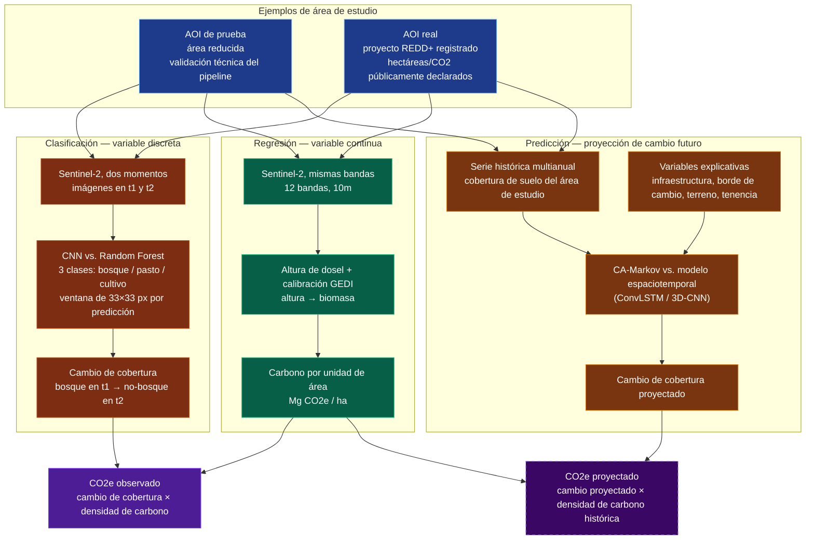

# Arquitectura del pipeline de verificación satelital

Este documento presenta la arquitectura general del pipeline de verificación satelital para
créditos de carbono en el Chaco paraguayo, y el fundamento metodológico de sus tres componentes
principales: clasificación de cobertura, estimación de carbono, y proyección de cambio futuro.

## Diagrama de arquitectura

La línea punteada en la caja de CO2e proyectado es intencional: distingue una proyección,
construida sobre relaciones ya calibradas en el bloque retrospectivo, de una observación directa.
Cuando no existe una relación calibrada para un tipo de transición dado, el sistema reporta el
valor como no disponible en lugar de generar una estimación sin respaldo.

## Justificación de cada modelo

**CNN**: candidata de clasificación porque puede aprovechar contexto espacial (textura, patrones
de dosel) dentro de la ventana de 33×33 píxeles — algo que un clasificador que evalúa cada píxel
de forma aislada no puede aprovechar por diseño, independientemente de cuán bien esté ajustado.

**Random Forest**: baseline de clasificación porque es el estándar de comparación en teledetección
para esta tarea, económico de entrenar, y transparente por construcción (se puede inspeccionar qué
variable pesó en cada decisión sin necesitar una capa de interpretabilidad aparte).

**Grad-CAM**: se agrega sobre la CNN, no como certificador de que una predicción sea correcta, sino
como mecanismo de auditoría. Genera, para cada predicción, un mapa de calor que indica qué región
de la imagen sostuvo esa clasificación, permitiendo a un revisor humano verificar si el modelo se
basó en evidencia razonable o si incurrió en un error sistemático identificable (por ejemplo,
confundir una nube con una zona desmontada). No certifica que el resultado sea correcto, no
detecta manipulación intencional de las imágenes de entrada, no verifica la calidad del propio
ground truth de entrenamiento, y no sustituye la validación de campo — su función es reducir el
costo de auditar una predicción, no eliminar la necesidad de hacerlo.

**Altura de dosel (modelo ETH Zürich) + calibración GEDI L4A**: elegidos sobre la alternativa de
usar un producto de biomasa ya calibrado (p. ej. Potapov/GLAD) porque ETH entrega altura e
incertidumbre en bruto, dejando la calibración a biomasa como un paso explícito y auditable en
este pipeline, en lugar de heredar una calibración de caja negra de terceros. GEDI L4A se usa como
referencia de calibración por ser el estándar satelital revisado por pares, y es el mismo dato
contra el que el propio modelo ETH fue validado en su publicación original.

**CA-Markov**: baseline de predicción porque es el método establecido en la literatura de modelado
de cambio de uso de suelo, e interpretable por construcción — la matriz de transición y los pesos
de idoneidad son en sí mismos la explicación del resultado, sin necesitar una capa de
interpretabilidad añadida.

**Modelo espaciotemporal (ConvLSTM / 3D-CNN)**: candidato de predicción porque puede aprender
patrones de cambio directamente de la serie histórica multianual, sin que sea necesario
especificar a mano las reglas de vecindario ni los pesos de las variables explicativas que
CA-Markov sí requiere.

## Fundamento metodológico: por qué clasificación, regresión y predicción

Las tres componentes de esta arquitectura no son redundantes entre sí: cada una responde una
pregunta que las otras dos no pueden responder, y las tres juntas conforman el mínimo necesario
para que el pipeline funcione como herramienta de verificación, no solo como un ejercicio de
clasificación de imágenes.

**Clasificación (¿dónde?)**. Establecer qué áreas cambiaron de cobertura es la base indispensable
de cualquier sistema de monitoreo satelital: sin esta capa no hay forma de verificar si la
superficie de bosque, pastura o cultivo declarada por un proyecto corresponde a lo observable por
satélite. Es la condición necesaria, aunque no suficiente, del resto del pipeline.

**Regresión (¿cuánto?)**. La clasificación por sí sola entrega una magnitud en hectáreas, pero el
mercado de créditos de carbono transa en toneladas de CO2, no en superficie. Sin una estimación
cuantitativa de biomasa y carbono, un resultado de clasificación —por preciso que sea— no responde
la pregunta que efectivamente le importa al mercado ni permite contrastarlo contra las cifras
públicamente reclamadas por un proyecto. La regresión es lo que traduce un resultado espacial en
una magnitud verificable.

**Predicción (¿qué sigue?)**. Los dos componentes anteriores son enteramente retrospectivos:
permiten auditar cambio que ya ocurrió, pero no anticipar dónde es probable que ocurra a
continuación. Un sistema de verificación que solo mira hacia atrás llega, por construcción,
siempre después del hecho. Incorporar una capa predictiva traslada el sistema de un rol
exclusivamente forense a uno con valor para la priorización de recursos de monitoreo y
fiscalización, sin sustituir ni debilitar el rigor retrospectivo en el que se apoya: la proyección
reutiliza explícitamente las relaciones ya calibradas en el bloque retrospectivo, en lugar de
introducir una fuente de incertidumbre independiente.

En los tres componentes se aplica el mismo criterio de evaluación: un modelo simple e
interpretable como referencia (Random Forest, CA-Markov), contrastado contra un modelo candidato
de mayor complejidad (CNN, modelo espaciotemporal), sin asumir de antemano que la complejidad
adicional se traduce en mejor desempeño. Un resultado donde el modelo de referencia iguala o
supera al candidato es, en este marco, un hallazgo metodológico válido, no una falla del diseño.
