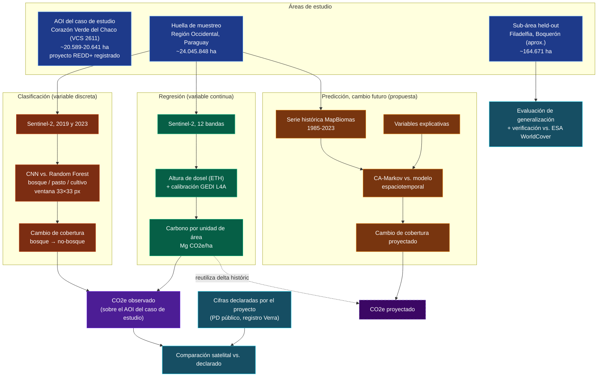

# Arquitectura del pipeline de verificación satelital

Este documento presenta la arquitectura del pipeline de verificación satelital para créditos de
carbono en el Chaco paraguayo: las fuentes de datos utilizadas, las áreas de estudio definidas y
la razón de cada una, el procesamiento aplicado (modelos y técnicas) y los productos derivados
(comparación de cobertura, estimación de carbono observado y proyectado).

## Diagrama general

Las secciones siguientes explican cada bloque de este diagrama en detalle: de dónde sale cada
dato, cómo se procesa y para qué se usa el resultado.

## 1. Fuentes de datos

| Fuente | Qué es | Cobertura temporal/espacial | Por qué esta fuente y no una alternativa |
|---|---|---|---|
| **Sentinel-2 L2A** (Copernicus/ESA) | Imágenes multiespectrales, 13 bandas, 10 m de resolución nativa, revisita nominal de 5 días | Global; en este proyecto, usable de forma densa desde 2019 sobre el área de trabajo (chequeo empírico: 14 escenas en 2018 contra 73 en 2019 sobre el mismo polígono) | Resolución más fina que Landsat (30 m) y acceso a bandas red-edge/SWIR que un RGB simple no tiene. Se usa Nivel-2A porque ya viene corregido atmosféricamente |
| **MapBiomas Chaco, Colección 5** | Clasificación de cobertura de suelo, un raster por año (1985-2023, 39 capas), 30 m, derivado de Landsat | Gran Chaco americano; en este proyecto, recortado a Paraguay | Es el único producto abierto con clasificación anual a escala de bioma y con suficiente profundidad histórica para modelar tendencia. Además evita tener que digitalizar el ground truth a mano, algo inviable en el volumen que pide entrenar un clasificador |
| **ESA WorldCover v200** | Cobertura de suelo global, 10 m, año de referencia 2021 | Global | Su resolución nativa coincide con la de Sentinel-2, a diferencia de MapBiomas (30 m). Se usa solo como verificación independiente sobre un área que nunca entra en entrenamiento; mezclarlo con las etiquetas de entrenamiento sería circular |
| **ETH Global Canopy Height** (Lang, Jetz, Schindler y Wegner, 2023, *Nature Ecology & Evolution*) | Modelo pre-entrenado que infiere altura de dosel a partir de Sentinel-2, con capa de incertidumbre propia, año base 2020 | Global | Se prefirió sobre la alternativa Potapov/GLAD (UMD) porque entrega altura e incertidumbre en bruto y deja la calibración a biomasa como un paso propio, auditable, en vez de heredar una calibración ya resuelta por terceros |
| **GEDI L4A** (`GEDI_L4A_AGB_Density_V3`, NASA/ORNL DAAC) | Densidad de biomasa aérea medida por lidar espacial, punto por punto | Abril 2019 a marzo 2023 sobre el AOI del caso de estudio (39 gránulos, 3.823 footprints de calidad tras filtrar por `l4a_quality_flag_rel3`, unos 18,6 footprints de calidad cada 100 ha) | Es la referencia estándar de biomasa aérea satelital, revisada por pares, y es el mismo dato contra el cual el propio modelo ETH fue validado en su publicación original |
| **FAO GAUL 2015, nivel 1** | Límites administrativos oficiales por país y departamento | Paraguay: Alto Paraguay, Boquerón y Presidente Hayes (Región Occidental) | Ya está disponible como asset nativo en Google Earth Engine, así que define la huella de muestreo ampliada (sección 2) sin necesitar un archivo geoespacial aparte |
| **Variables explicativas para el modelo predictivo** (distancia a red vial, distancia al borde de cambio observado, pendiente del terreno, tenencia de tierra o estatus de área protegida) | Capas de contexto geográfico, no series de cobertura | Pendiente de definición final | La distancia al borde de cambio se puede derivar directamente de la propia serie MapBiomas. Red vial y pendiente tienen fuentes estándar (OpenStreetMap, SRTM) que todavía no se incorporaron. Tenencia de tierra y área protegida no tienen fuente identificada por ahora: queda como pendiente explícito, no resuelto por omisión |

## 2. Áreas de estudio: por qué son tres y no una

El pipeline trabaja sobre tres extensiones geográficas distintas. Cada una cumple una función que
las otras dos no cubren; no son alternativas entre sí ni una versión simplificada de otra.

**AOI del caso de estudio, Corazón Verde del Chaco (VCS 2611).** El boundary es aproximado,
digitalizado a mano a partir de la Figura 2.2 del Project Description público del proyecto: no
existe un shapefile ni KML público descargable, y el Registro Verra funciona como aplicación web
que no se puede scrapear directamente. El área calculada ronda las 20.589 ha por cálculo geodésico
con `pyproj`, o 20.641 ha según el cálculo propio de Google Earth Engine (la diferencia del 0,25 %
viene del método de cálculo de área geodésica de cada herramienta, no de un error de
digitalización). Se validó contra la superficie inicial declarada en el PD, 20.515,0 ha, con una
diferencia del 0,8 %. Esta es la única de las tres áreas con cifras de hectáreas y CO2
públicamente reclamadas ante un registro, así que es la que habilita la comparación satelital
contra lo declarado (sección 4), y por eso también la más verificable contra un dato externo real.
Sobre ella se confirmó además la factibilidad de GEDI L4A, con densidad de footprints de calidad
muy por encima del mínimo que pide la regresión altura-biomasa.

**Huella de muestreo, departamentos de la Región Occidental.** El AOI del caso de estudio, aunque
sea el objeto de la auditoría, resulta insuficiente como base de entrenamiento: se verificó que no
contiene un solo píxel de la clase cultivo, ni en 2019 ni en 2023 (su dinámica de cambio observada
es bosque contra pastura). Entrenar el clasificador solo con el AOI dejaría esa clase sin ningún
ejemplo real. La huella de muestreo, los tres departamentos que forman el Chaco paraguayo, resuelve
esto sin sumar ninguna fuente de datos nueva, porque tanto MapBiomas como GEDI ya cubren todo el
Chaco de forma nativa. El AOI del caso de estudio queda geográficamente contenido dentro de esta
huella, en el departamento de Alto Paraguay.

**Sub-área held-out, Filadelfia, Boquerón.** Un recorte de unos 40×40 km dentro de la huella de
muestreo, excluido a propósito de todo entrenamiento, validación o ajuste de hiperparámetros. Las
coordenadas son aproximadas, con el mismo criterio que el AOI del caso de estudio: no hay un límite
catastral público exacto. Se eligió por ser una zona de frontera agrícola conocida (colonias
menonitas), y esto se confirmó con datos reales: contiene cobertura de cultivo genuina (2.476.960
píxeles de 10 m según ESA WorldCover), algo que el AOI del caso de estudio no tiene. Cumple dos
funciones que ninguna otra área cubre: evaluar si el clasificador entrenado generaliza a una región
geográficamente distinta dentro del mismo bioma, y servir de zona de verificación de exactitud
independiente contra ESA WorldCover, con ejemplos reales de cultivo que el AOI del caso de estudio
no posee. Se confirmó una superposición de 0 ha con el AOI del caso de estudio.

## 3. Procesamiento: qué se hace con cada fuente

### 3.1 Clasificación de cobertura (variable discreta, componente retrospectivo)

Los datos de entrenamiento se muestrean sobre la huella de muestreo, no solo sobre el AOI del caso
de estudio, por lo explicado en la sección 2. Cada ejemplo de entrenamiento es una ventana
Sentinel-2 de 33×33 píxeles centrada en un bloque de 3×3 píxeles nativos (10 m) que corresponde
exactamente a un píxel de MapBiomas (30 m). Esa correspondencia 3×3 sale directo de la relación de
resolución (30 m equivale a 3 × 10 m) y se obtiene reproyectando MapBiomas sobre la grilla propia
de Sentinel-2. La ventana de 33×33 px es la que ve el modelo como entrada, para darle contexto
espacial real; el bloque de 3×3 sigue siendo únicamente la unidad de alineación con la etiqueta. La
clase no incluye "desmonte" como cuarta categoría: MapBiomas clasifica el estado de la cobertura
por año, no eventos de tala, así que el cambio se obtiene comparando dos clasificaciones de fechas
distintas, en vez de predecirse directamente.

### 3.2 Estimación de carbono (variable continua, componente retrospectivo)

La calibración altura-biomasa se ajusta una sola vez, usando los footprints GEDI L4A disponibles
sobre el AOI del caso de estudio (2019-2023), y después se aplica a la altura de dosel inferida
sobre cualquier año dentro de esa ventana temporal. La conversión biomasa-carbono-CO2e usa los
factores estándar del IPCC: fracción de carbono 0,47, factor raíz-tallo entre 0,20 y 0,24 según la
zona ecológica, y relación molecular CO2:C de 3,67. Se incluye biomasa subterránea para no reportar
solo el carbono aéreo.

### 3.3 Predicción de cambio futuro (propuesta, pendiente de confirmar si es obligatoria u opcional)

"Serie histórica multianual" se refiere puntualmente a usar la profundidad temporal completa de
MapBiomas Chaco (39 capas anuales, 1985-2023), en lugar del par de fechas que usa la clasificación
(3.1). Con dos fechas solo se sabe si hubo o no cambio; con la serie completa, CA-Markov puede
construir una matriz de transición basada en la frecuencia histórica real, y el modelo
espaciotemporal candidato puede aprender una tendencia a lo largo del tiempo, no solo un salto
puntual entre dos momentos.

"Variables explicativas" son capas estáticas o casi estáticas de contexto geográfico, no series de
cobertura, que informan dónde dentro del espacio es más probable que se concentre el próximo
cambio, dado un patrón histórico (por ejemplo, la cercanía a infraestructura vial o a un borde de
cambio ya observado). El estado real de disponibilidad de estas capas está en la sección 1.

## 4. Productos: qué se calcula a partir de todo esto

**CO2e observado y auditoría.** Se calcula solo sobre los píxeles del AOI del caso de estudio,
aunque el modelo se haya entrenado con la huella de muestreo ampliada, y se contrasta contra las
hectáreas y toneladas de CO2 que el proyecto declaró públicamente ante Verra. Este es el resultado
central del componente retrospectivo.

**CO2e proyectado.** No hace falta imagen satelital futura ni volver a correr el modelo de altura
de dosel. Se reutiliza el delta de densidad de carbono ya calculado por tipo de transición
observada (3.2) y se aplica sobre los píxeles que el modelo predictivo marca como propensos a
cambiar. Si no existe un delta histórico calculado para el tipo de transición que se predice, el
valor se reporta como no disponible en vez de estimarse sin respaldo. Por eso en el diagrama esta
caja aparece con línea punteada: es una proyección apoyada en relaciones ya medidas, no una
observación nueva.

**Evaluación de generalización.** Se ejecuta sobre la sub-área held-out, nunca sobre el AOI del
caso de estudio ni sobre datos usados en entrenamiento. Combina dos verificaciones independientes:
la exactitud del clasificador en una región geográfica que nunca vio, y el contraste contra ESA
WorldCover.

## 5. Justificación de cada modelo

**CNN.** Candidata de clasificación porque puede aprovechar contexto espacial (textura, patrones de
dosel) dentro de la ventana de 33×33 píxeles. Un clasificador que evalúa cada píxel de forma
aislada no puede sacarle provecho a eso por más ajustado que esté, así que si el CNN gana, gana por
una razón estructural real, no solo por mejor ajuste.

**Random Forest.** Baseline de clasificación. Es el estándar de comparación en teledetección para
esta tarea, barato de entrenar, y transparente por construcción: se puede ver qué variable pesó en
cada decisión sin agregar ninguna capa de interpretabilidad extra.

**Grad-CAM.** Se agrega sobre la CNN, pero no certifica que una predicción sea correcta: es un
mecanismo de auditoría. Para cada predicción genera un mapa de calor que muestra qué región de la
imagen sostuvo esa clasificación, y eso le permite a un revisor humano chequear si el modelo se
basó en evidencia razonable o si se equivocó de forma identificable, como confundir una nube con
una zona desmontada. No detecta manipulación intencional de las imágenes de entrada, no verifica la
calidad del propio ground truth de entrenamiento, y no reemplaza la validación de campo. Lo que
hace es bajar el costo de auditar una predicción, no eliminar la necesidad de hacerlo.

**Altura de dosel (ETH) más calibración GEDI L4A.** La justificación de la fuente ya está en la
sección 1. Como técnica, la calibración es una regresión potencial log-log simple (`AGBD = a·H^b`),
no un modelo de aprendizaje profundo: se elige porque es el método estándar en la literatura
(Asner y Mascaro, 2014) para calibrar una métrica lidar simple contra parcelas o footprints de
referencia.

**CA-Markov.** Baseline de predicción, elegido por ser el método establecido en la literatura de
modelado de cambio de uso de suelo. Es interpretable por construcción: la matriz de transición y
los pesos del mapa de idoneidad son en sí mismos la explicación del resultado, sin necesitar nada
extra encima.

**Modelo espaciotemporal (ConvLSTM o 3D-CNN).** Candidato de predicción. Puede aprender patrones de
cambio directamente de la serie histórica multianual, sin que alguien tenga que especificarle a
mano las reglas de vecindario ni los pesos de las variables explicativas que CA-Markov sí necesita.

## 6. Por qué clasificación, regresión y predicción

Estas tres componentes no son redundantes entre sí. Cada una responde una pregunta que las otras
dos no pueden responder, y juntas son el mínimo necesario para que el pipeline funcione como
herramienta de verificación y no solo como un ejercicio de clasificación de imágenes.

**Clasificación, ¿dónde?** Saber qué áreas cambiaron de cobertura es la base de cualquier sistema
de monitoreo satelital. Sin esto no hay forma de verificar si la superficie de bosque, pastura o
cultivo que declara un proyecto corresponde a lo que efectivamente se ve desde el satélite. Es
condición necesaria del resto del pipeline, aunque no suficiente por sí sola.

**Regresión, ¿cuánto?** La clasificación por sí sola entrega hectáreas, pero el mercado de créditos
de carbono transa en toneladas de CO2, no en superficie. Por más preciso que sea, un resultado de
clasificación no responde la pregunta que le importa al mercado ni permite contrastarlo contra las
cifras que un proyecto reclama públicamente. La regresión es lo que convierte un resultado espacial
en una magnitud que se puede verificar.

**Predicción, ¿qué sigue?** Los dos componentes anteriores son enteramente retrospectivos: sirven
para auditar cambio que ya pasó, pero no para anticipar dónde es probable que pase el próximo. Un
sistema que solo mira para atrás llega, por construcción, siempre después del hecho. Agregar una
capa predictiva lleva al sistema de un rol puramente forense a uno con valor para priorizar
recursos de monitoreo y fiscalización, sin debilitar el rigor retrospectivo en el que se apoya: la
proyección reutiliza las relaciones ya calibradas en el bloque retrospectivo en vez de sumar una
fuente de incertidumbre nueva.

En los tres componentes se aplica el mismo criterio de evaluación: un modelo simple e
interpretable como referencia (Random Forest, CA-Markov) contra un candidato más complejo (CNN,
modelo espaciotemporal), sin asumir de antemano que la complejidad adicional se traduce en mejor
desempeño. Que el modelo de referencia iguale o supere al candidato es, en este marco, un hallazgo
metodológico válido, no una falla del diseño.

## 7. Ítems abiertos

- Variables explicativas del modelo predictivo: tenencia de tierra y área protegida no tienen
  fuente identificada. Red vial y pendiente tienen fuente estándar disponible pero todavía no
  incorporada.
- El componente de predicción (3.3) no forma parte de la metodología retrospectiva originalmente
  acordada. Falta confirmar si es un componente obligatorio del núcleo del TFM o una extensión
  opcional.
- La evaluación de generalización (sección 4) está diseñada pero no ejecutada: requiere que el
  clasificador de 3.1 esté entrenado a volumen completo, no solo con la muestra de prueba usada
  hasta ahora para validar el mecanismo de extracción de datos.
